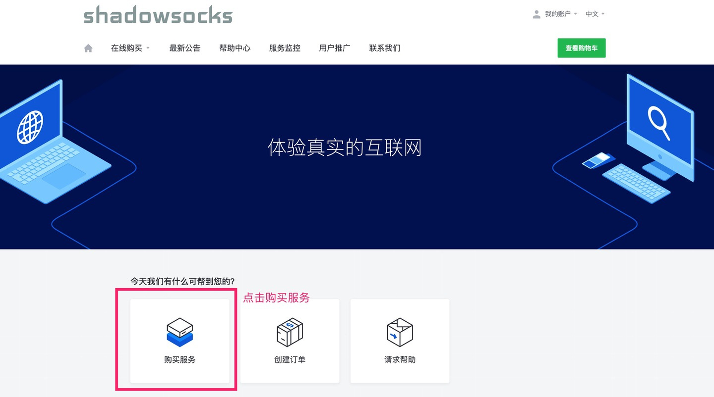
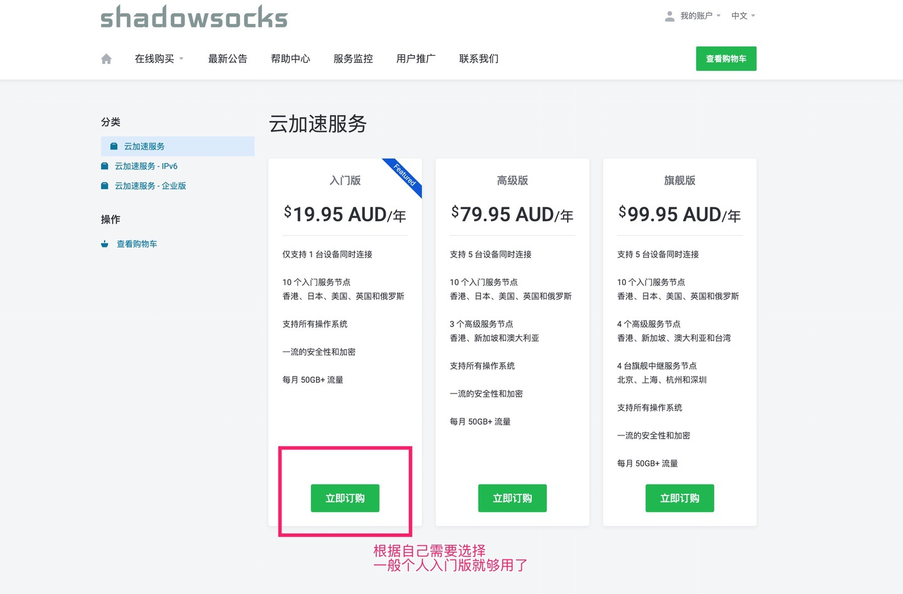
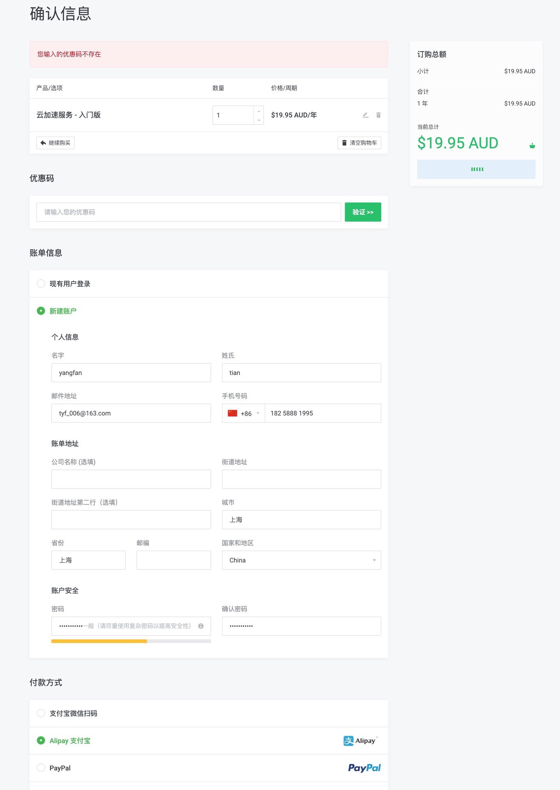
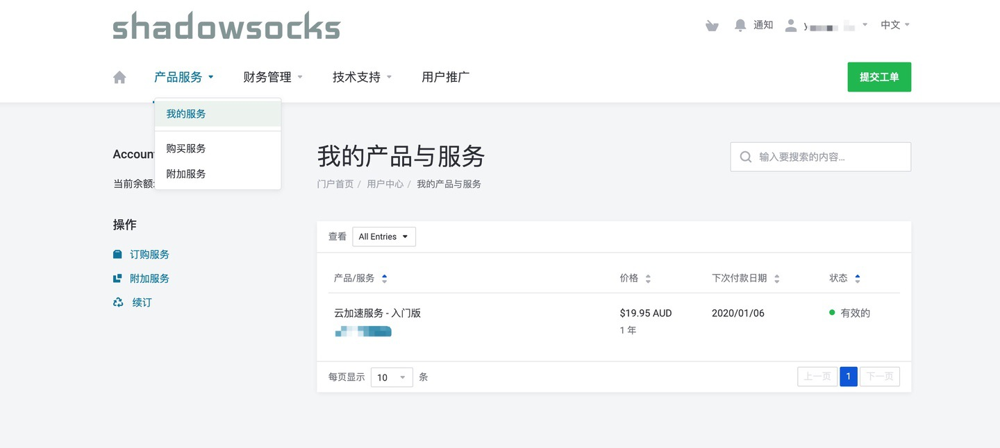

## 蓝灯

官方称「秒杀 VPN」，快速、稳定、安全，但是有时候也没那么稳定。**支持 Windows、Mac、安卓和 Ubuntu。官方称 2019 年可能会支持 iOS**。下载后安装即可使用。免费版有流量和速度限制。

官方下载地址：[https://getlantern.org/zh_CN/index.html](https://getlantern.org/zh_CN/index.html)。
若打不开可访问官方 GitHub 项目下载：[https://github.com/getlantern/forum](https://github.com/getlantern/forum)。

输入我的邀请码【**L9UHQN**】，可以获得三个月的蓝灯专业版！立即下载 https://github.com/getlantern/forum

## SS

需要购买服务账号和安装各设备的对应软件。

### 购买服务账号

推荐 SS 服务购买地址 ：**[https://portal.shadowsocks.nu/aff.php?aff=13674](https://portal.shadowsocks.nu/aff.php?aff=13674)**

点击「购买服务」：

选择并订购服务：

填写信息（可以只填姓、名、邮箱、手机号），支持支付宝支付：

购买成功后，在「我的服务」中可以看到购买的服务，点击后可看到服务的账号密码。

### 安装 SS 软件

点击「技术支持」-「资源下载」可查看各客户端软件下载地址，或者直接打开[https://portal.shadowsocks.nu/download](https://portal.shadowsocks.nu/download)。

iOS 客户端基本需要非国区 App Store iTunes 账号才行。比如美区。推荐安装 Shadowrocket、Potatso 等。

安装后，在软件登录服务账号，既可愉快的上网了。

